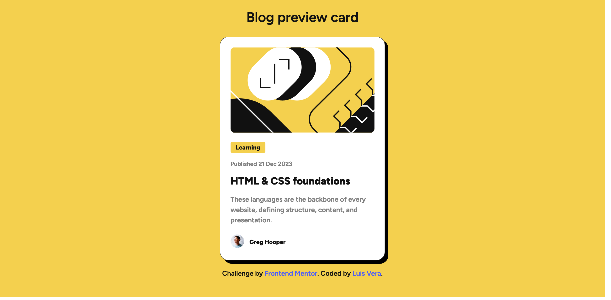

# Frontend Mentor - Blog preview card solution

This is a solution to the [Blog preview card challenge on Frontend Mentor](https://www.frontendmentor.io/challenges/blog-preview-card-ckPaj01IcS).

## Table of contents

- [Overview](#overview)
  - [The challenge](#the-challenge)
  - [Screenshot](#screenshot)
  - [Links](#links)
- [My process](#my-process)
  - [Built with](#built-with)
  - [What I learned](#what-i-learned)
  - [Continued development](#continued-development)
  - [Useful resources](#useful-resources)
- [Author](#author)
- [Acknowledgments](#acknowledgments)

## Overview

### The challenge

Users should be able to:

- See hover state for all interactive elements on the page

### Screenshot

### Links

- Solution URL: [Github](https://github.com/LuisVera1/FrontendMentor-Blog-preview-card)
- Live Site URL: [See solution](https://frontend-mentor-blog-preview-card-chi.vercel.app/)

## My process

### Built with

- Semantic HTML5 markup
- CSS custom properties
- Flexbox
- Mobile-first workflow
- [React](https://reactjs.org/) - JS library

### What I learned

This is my first project on Frontend Mentor.

For this project I focused on adaptive development and the use of the BEM methodology for a more understandable code.

### Continued development

I am going to work on more projects, and at the same time improve the semantics and optimization.

## Author

- Website - [Luisvera.dev](https://www.luisvera.dev)
- Frontend Mentor - [@LuisVera1](https://www.frontendmentor.io/profile/LuisVera1)

## Acknowledgments

Thanks to Frontend Mentor.